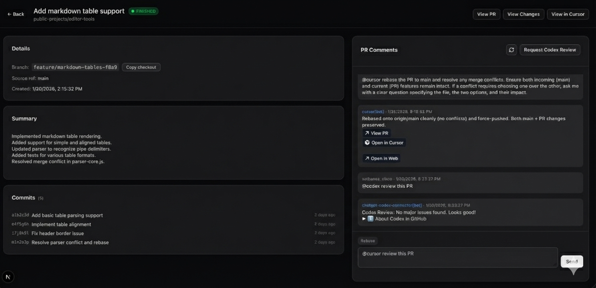

# Cursor Agent Orchestrator

Web dashboard for monitoring and interacting with Cursor Background Agents.

Uses the Cursor Cloud Agent API endpoints documented here:
[Cursor Cloud Agent API](https://cursor.com/docs/cloud-agent/api/endpoints).

## Screenshots




## Requirements

- Node.js 18+
- pnpm

## Quickstart

1. Install dependencies:
   ```bash
   pnpm install
   ```

2. Copy `.env.example` to `.env.local` and add your API keys:
   ```bash
   cp .env.example .env.local
   ```

3. Run the dev server:
   ```bash
   pnpm dev
   ```

4. Open http://localhost:3098

## Scripts

- `pnpm dev` – start the dev server on port 3098
- `pnpm build` – production build
- `pnpm start` – run the production server
- `pnpm lint` – run ESLint
- `pnpm lint:ox` – run Oxlint on `src/`
